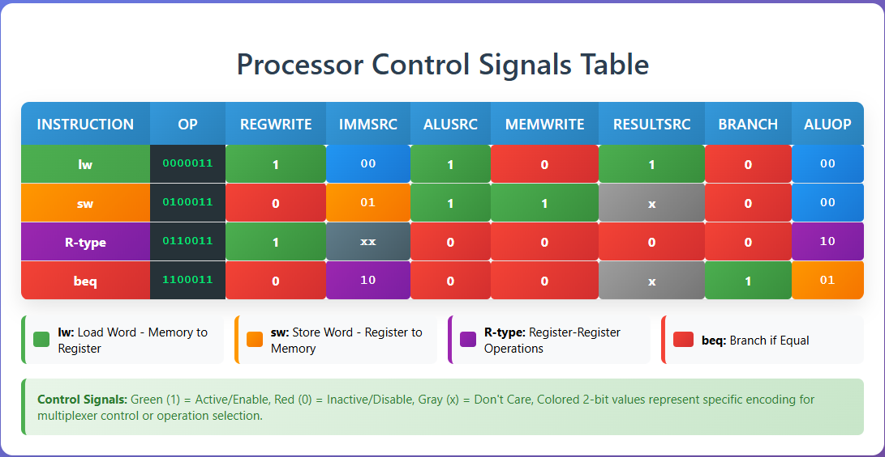
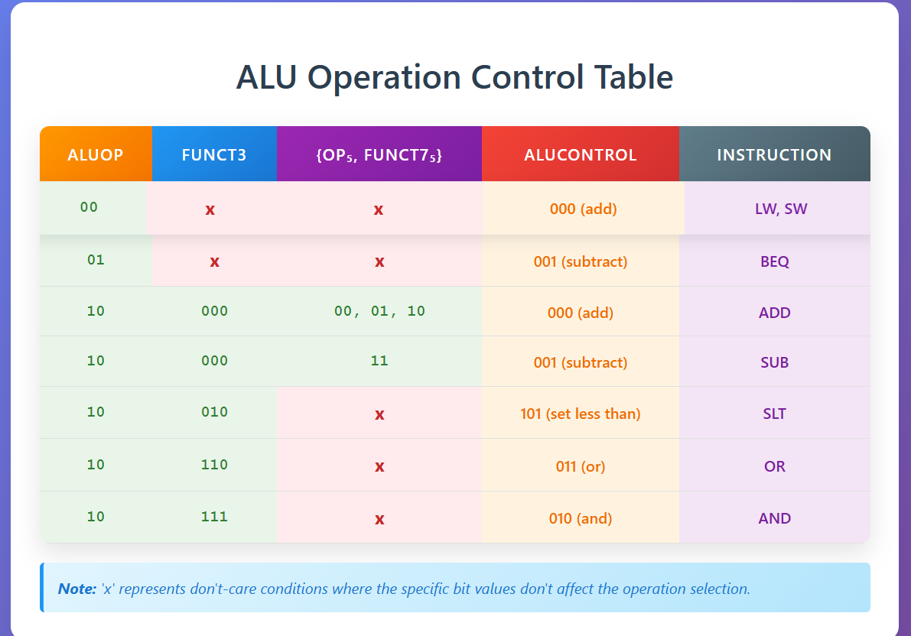
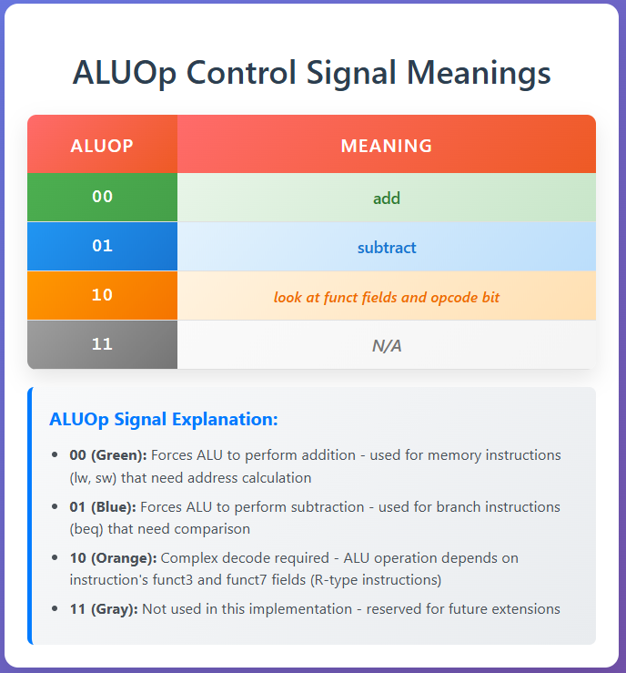
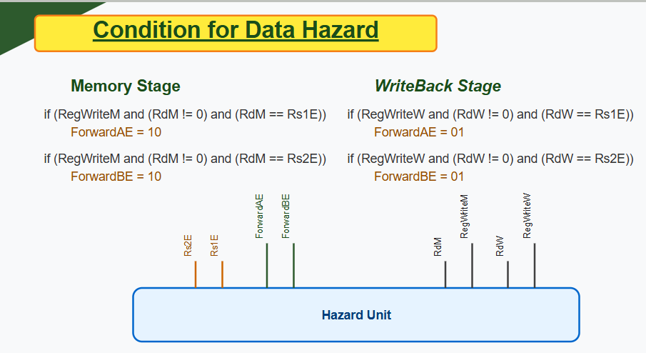
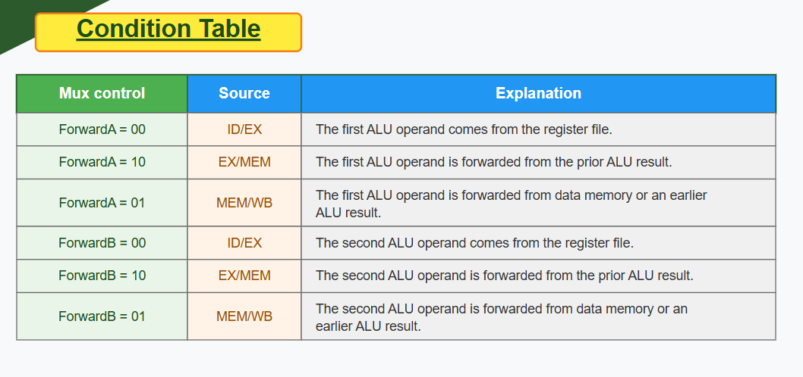
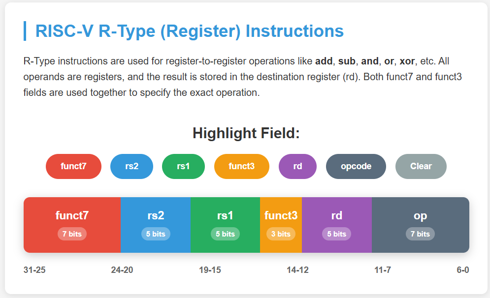
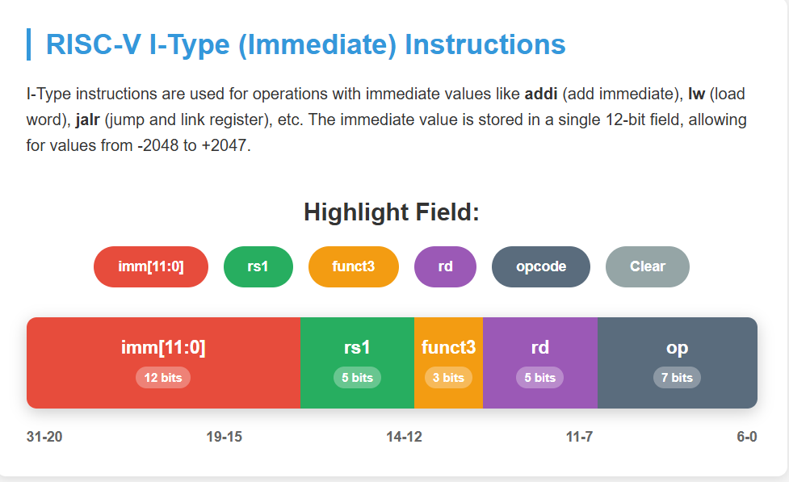
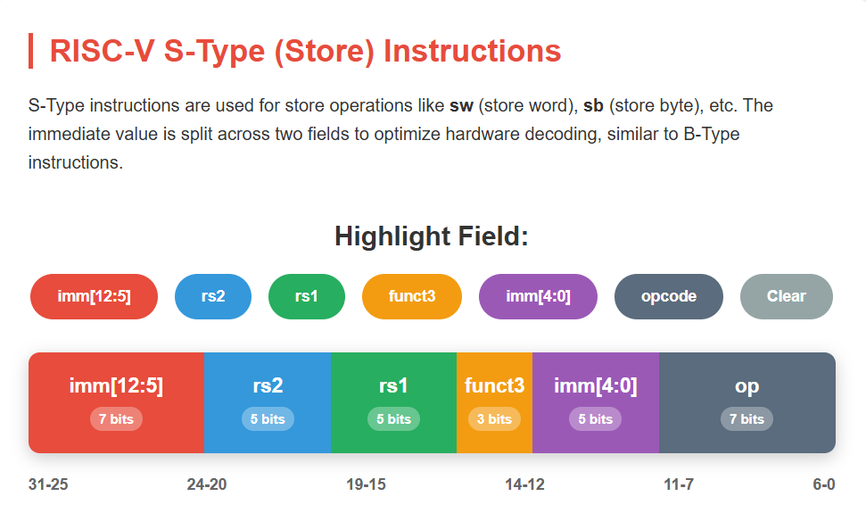
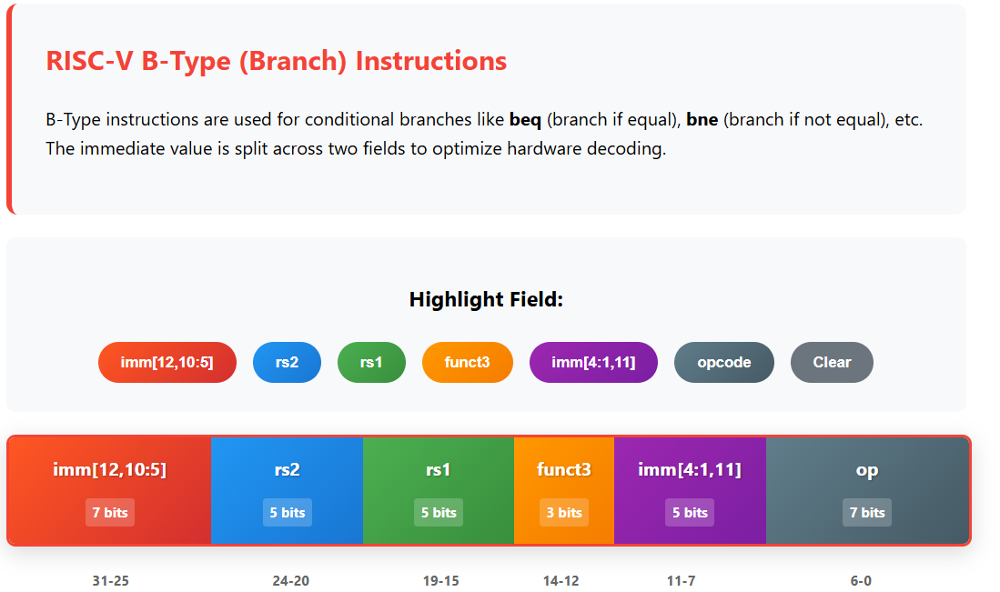

# RISCV-Microarchitecture-Pipeline
"A Verilog-based RISC-V RV32I Pipelined Processor implementing 5-stage architecture (IF, ID, EX, MEM, WB) with hazard detection, forwarding, and support for R/I/S/B-type instructions. Includes detailed instruction encoding, modular design, and simulation waveforms."

# ⭐ RISCV-Microarchitecture-Pipeline: Unleashing Performance! ⭐

## 🚀 From Single-Cycle to Pipelined Architecture 🚀

This repository showcases the Verilog implementation of a RISC-V Pipelined Core, specifically a 5-stage pipeline microarchitecture. The design transitions from a single-cycle concept to a pipelined approach, enabling multiple instructions to be processed concurrently across distinct stages. This parallelism aims to significantly boost clock frequency and overall performance. The core features a robust pipeline structure (Fetch, Decode, Execute, Memory, and Writeback stages) and incorporates a Hazard Unit for efficient data hazard detection and resolution through forwarding/bypassing mechanisms. The project includes all necessary modules for a functional CPU, such as an ALU, Control Unit, Instruction and Data Memories, Register File, and various multiplexers and adders, along with a testbench for simulation and waveform analysis.

### Pipelined Datapath Overview
*[Insert PNG image of the complete pipelined architecture, similar to "Pipeline Datapath" on Page 28 or Page 42 of the RISC_V_Microarchitecture_Pipelined_Core_Design_Final.pdf here]*

## 📚 Table of Contents

1. [Project Overview](#1-project-overview)
2. [Pipeline Stages](#2-pipeline-stages)
   - [Fetch Cycle](#1-fetch-cycle-fetch_cyclev-)
   - [Decode Cycle](#2-decode-cycle-decode_cylev-)
   - [Execute Cycle](#3-execute-cycle-execute_cyclev-)
   - [Memory Cycle](#4-memory-cycle-memory_cyclev-)
   - [Writeback Cycle](#5-writeback-cycle-writeback_cyclev-)
3. [Key Modules & Components](#3-key-modules--components)
   - [ALU](#alu-aluv-)
   - [Control Unit](#control-unit-main-decoder--alu-decoder-)
   - [Data Memory](#data-memory-data_memoryv-)
   - [Instruction Memory](#instruction-memory-instruction_memoryv-)
   - [Mux & Mux_3_by_1](#mux--mux_3_by_1-muxv-)
   - [PC Module & PC Adder](#pc-module--pc-adder-pcv-pc_adderv-)
   - [Register File](#register-file-register_filev-)
   - [Sign Extend](#sign-extend-sign_extendv-)
   - [Hazard Unit](#hazard-unit-hazard_unitv-)
4. [Instruction Formats Supported](#4-instruction-formats-supported)
   - [R-Type](#r-type-instructions-register-type-)
   - [I-Type](#i-type-instructions-immediate-type-)
   - [S-Type](#s-type-instructions-store-type-)
   - [B-Type](#b-type-instructions-branch-type-)
5. [Signal Conventions](#5-signal-conventions-)
6. [Simulation Setup](#6-simulation-setup-)
7. [Waveform Analysis](#7-waveform-analysis-)
8. [Acknowledgement](#8-acknowledgement-)

## 1. Project Overview

The core objective of this project is to implement a robust RISC-V pipelined architecture. Pipelining, a cornerstone of modern processor design, divides the instruction execution process into five sequential stages. This allows a new instruction to begin execution in each clock cycle, leading to an approximate five-fold increase in clock frequency compared to a single-cycle design. Our design specifically addresses and resolves data hazards, a common challenge in pipelined processors, through an advanced forwarding mechanism.

## 2. Pipeline Stages

The RISC-V pipeline is meticulously structured into five distinct stages, ensuring efficient instruction throughput:

### 1. Fetch Cycle (`fetch_cycle.v`) 📥

This initial stage is dedicated to fetching the instruction from the Instruction Memory and concurrently advancing the Program Counter (PC).

**Inputs:**
- `clk`: System clock signal
- `rst`: Asynchronous reset signal
- `PCSrcE`: Control signal from the Execute stage, determining if the next PC value is for a branch
- `PCTargetE [31:0]`: The calculated target address for branch instructions, originating from the Execute stage

**Outputs:**
- `InstrD [31:0]`: The fetched 32-bit instruction, passed to the Decode stage
- `PCD [31:0]`: The Program Counter value for the current instruction, forwarded to the Decode stage
- `PCPlus4D [31:0]`: The value of PC + 4, also passed to the Decode stage

**Key Internal Components:**
- **PC_MUX**: A 2-to-1 multiplexer that selects between the incremented PC (PCPlus4F) and the branch target address (PCTargetE) to determine the PC_Next
- **Program_Counter**: A dedicated module that updates the PCF (Program Counter Fetch) on the positive edge of the clock
- **Instruction_Memory**: This memory unit stores the program instructions and provides InstrF based on the PCF address
- **PC_Adder**: Computes PCPlus4F by adding 4 to the current PCF
- **Pipeline Registers**: (InstrF_reg, PCF_reg, PCPlus4F_reg): These registers hold the fetched instruction and PC values, transferring them to the next pipeline stage at the clock edge

### 2. Decode Cycle (`Decode_Cyle.v`) 🧠

In this crucial stage, the fetched instruction is deciphered. Register operands are read from the Register File, and any immediate values are sign-extended. The Control Unit generates all necessary control signals for subsequent stages.

**Inputs:**
- `clk`: System clock signal
- `rst`: Asynchronous reset signal
- `InstrD [31:0]`: Instruction received from the Fetch stage
- `PCD [31:0]`: PC value from the Fetch stage
- `PCPlus4D [31:0]`: PC + 4 from the Fetch stage
- `RegWriteW`: Register write enable signal, forwarded from the Writeback stage for hazard detection
- `RDW [4:0]`: Destination register address from the Writeback stage, used for forwarding
- `ResultW [31:0]`: The final result data from the Writeback stage, crucial for data forwarding

**Outputs (Passed to Execute stage):**
- `RegWriteE, ALUSrcE, MemWriteE, ResultSrcE, BranchE`: Decoded control signals for the Execute stage
- `ALUControlE [2:0]`: Specifies the ALU operation for the Execute stage
- `RD1_E [31:0], RD2_E [31:0]`: Data read from the Register File for operand A and B respectively
- `Imm_Ext_E [31:0]`: The 32-bit sign-extended immediate value
- `RD_E [4:0]`: The destination register address for the current instruction
- `PCE [31:0]`: The PC value of the instruction, forwarded to Execute
- `PCPlus4E [31:0]`: The PC + 4 value, forwarded to Execute
- `RS1_E [4:0], RS2_E [4:0]`: Source register addresses, used by the Hazard Unit for forwarding decisions

**Key Internal Components:**
- **Control_Unit_Top**: This unit decodes the instruction's opcode, funct3, and funct7 fields to generate all necessary control signals for the pipeline
- **Register_File**: Reads values from the source registers (identified by InstrD[19:15] and InstrD[24:20]) and also supports writing back data to a destination register
- **Sign_Extend**: Responsible for extending the instruction's immediate value to 32 bits, handling both positive and negative numbers correctly based on ImmSrcD
- **Pipeline Registers**: (RegWriteD_r, ALUSrcD_r, MemWriteD_r, ResultSrcD_r, BranchD_r, ALUControlD_r, RD1_D_r, RD2_D_r, Imm_Ext_D_r, RD_D_r, PCD_r, PCPlus4D_r, RS1_D_r, RS2_D_r): These registers capture the control signals and data, transferring them to the Execute stage at the clock edge

### 3. Execute Cycle (`Execute_Cycle.v`) ⚡

This stage is where the primary computation happens. It performs arithmetic and logical operations using the ALU, calculates branch targets, and implements data forwarding to resolve hazards.

**Inputs:**
- `clk, rst`: Clock and reset signals
- `RegWriteE, ALUSrcE, MemWriteE, ResultSrcE, BranchE`: Control signals from Decode
- `ALUControlE [2:0]`: Specifies the ALU operation control
- `RD1_E [31:0], RD2_E [31:0]`: Register data from Decode
- `Imm_Ext_E [31:0]`: Sign-extended immediate from Decode
- `RD_E [4:0]`: Destination register address from Decode
- `PCE [31:0], PCPlus4E [31:0]`: PC values from Decode
- `ResultW [31:0]`: Result from Writeback (for forwarding)
- `ForwardA_E [1:0], ForwardB_E [1:0]`: Forwarding control signals for ALU operands A and B

**Outputs (Passed to Memory stage):**
- `PCSrcE`: PC source control for the Fetch stage (for branches)
- `RegWriteM, MemWriteM, ResultSrcM`: Control signals
- `RD_M [4:0]`: Destination register address
- `PCPlus4M [31:0]`: PC + 4
- `WriteDataM [31:0]`: Data to be written to memory
- `ALU_ResultM [31:0]`: ALU result
- `PCTargetE [31:0]`: Calculated branch target address

**Key Internal Components:**
- **Mux_3_by_1 srca_mux**: Selects Src_A from RD1_E, ResultW, or ALU_ResultM based on ForwardA_E
- **Mux_3_by_1 srcb_mux**: Selects Src_B_interim from RD2_E, ResultW, or ALU_ResultM based on ForwardB_E
- **Mux alu_src_mux**: Selects Src_B for the ALU from Src_B_interim or Imm_Ext_E based on ALUSrcE
- **ALU**: Performs arithmetic and logical operations. It generates ResultE and ZeroE
- **PC_Adder branch_adder**: Calculates PCTargetE by adding PCE and Imm_Ext_E
- **Pipeline Registers**: (RegWriteE_r, MemWriteE_r, ResultSrcE_r, RD_E_r, PCPlus4E_r, RD2_E_r, ResultE_r): Pipeline registers

### 4. Memory Cycle (`Memory_Cycle.v`) 💾

This stage handles all memory access operations, performing reads for load instructions and writes for store instructions.

**Inputs:**
- `clk, rst`: Clock and reset signals
- `RegWriteM, MemWriteM, ResultSrcM`: Control signals from Execute
- `RD_M [4:0]`: Destination register address from Execute
- `PCPlus4M [31:0], WriteDataM [31:0], ALU_ResultM [31:0]`: Data from Execute

**Outputs (Passed to Writeback stage):**
- `RegWriteW, ResultSrcW`: Control signals
- `RD_W [4:0]`: Destination register address
- `PCPlus4W [31:0], ALU_ResultW [31:0], ReadDataW [31:0]`: Data for Writeback

**Key Internal Components:**
- **Data_Memory**: Performs read/write operations based on MemWriteM and ALU_ResultM (address)
- **Pipeline Registers**: (RegWriteM_r, ResultSrcM_r, RD_M_r, PCPlus4M_r, ALU_ResultM_r, ReadDataM_r): Pipeline registers

### 5. Writeback Cycle (`Writeback_Cycle.v`) ✍️

This is the final stage of the pipeline, where the result of the executed instruction is written back to the Register File.

**Inputs:**
- `clk, rst, ResultSrcW`: Clock, reset, and control signals
- `PCPlus4W [31:0], ALU_ResultW [31:0], ReadDataW [31:0]`: Data from Memory

**Outputs:**
- `ResultW [31:0]`: Final result to be written to the Register File

**Key Internal Components:**
- **Mux result_mux**: Selects ResultW from ALU_ResultW or ReadDataW based on ResultSrcW

## 3. Key Modules & Components

### ALU (`ALU.v`) ➕➖✖️➗

The Arithmetic Logic Unit performs various operations based on the ALUControl signal.

**Inputs:**
- `A [31:0], B [31:0]`: Two 32-bit operands
- `ALUControl [2:0]`: A 3-bit control signal that dictates the operation to be performed

**Outputs:**
- `Result [31:0]`: The 32-bit output of the ALU operation
- `Carry, OverFlow, Zero, Negative`: 1-bit flags indicating the status of the operation (e.g., Zero is set to '1' if Result is all zeroes)

**Supported Operations (determined by ALUControl):**
- `3'b000` (add): Performs addition (A + B)
- `3'b001` (subtract): Performs subtraction (A - B)
- `3'b010` (and): Performs bitwise AND (A & B)
- `3'b011` (or): Performs bitwise OR (A | B)
- `3'b101` (set less than): Used for slt instruction, checks if A < B (signed comparison), indicated by Sum[31]

*Note: Other ALUControl values are considered "don't care" and their output behavior is not critical to the design's functionality under normal operation.*

### Control Unit (Main Decoder & ALU Decoder) 🚦

The Control Unit is the brain of the processor, generating all necessary control signals for the datapath based on the instruction's fields. It is modularly designed into two sub-units:

#### Main Decoder (`Main_Decoder.v`):

**Inputs:** `Op [6:0]` (the 7-bit opcode of the instruction)

**Outputs:** `RegWrite, ImmSrc [1:0], ALUSrc, MemWrite, ResultSrc, Branch, ALUOp [1:0]`

This decoder is responsible for generating most of the primary control signals based on the opcode. It also determines a 2-bit ALUOp signal, which provides a high-level command to the ALU_Decoder.

**MAIN decoder table:**

**MAIN decoder mapping :**



#### ALU Decoder (`ALU_Decoder.v`):

**Inputs:** `ALUOp [1:0], funct3 [2:0], funct7 [6:0], op [6:0]` (full opcode, specifically op[5])

**Output:** `ALUControl [2:0]` (the final 3-bit control signal for the ALU)

This decoder uses the ALUOp signal along with the instruction's funct3 and funct7 fields (and op[5]) to compute the precise ALUControl signal required by the ALU.

**ALUOp Meanings & ALUControl Table:**

**ALU operation control table :**


**ALU op control table  :**


### Data Memory (`Data_Memory.v`) 📦

A combinational read, clocked write memory block for data storage and retrieval.

**Inputs:** `clk, rst, WE` (write enable), `A [31:0]` (32-bit address), `WD [31:0]` (32-bit write data)

**Output:** `RD [31:0]` (32-bit read data)

- Data is written to memory on the positive edge of the clock if WE is asserted
- Data is read combinationally based on the address A
- Initialized with `mem[0] = 32'h00000000`

### Instruction Memory (`Instruction_Memory.v`) 📜

A combinational read memory block dedicated to storing program instructions.

**Inputs:** `rst, A [31:0]` (32-bit instruction address)

**Output:** `RD [31:0]` (32-bit read instruction)

- Instructions are read combinationally based on the address A[31:2]
- The memory is initialized by loading contents from `memfile.hex` at the start of simulation

### Mux & Mux_3_by_1 (`Mux.v`) ↔️

General-purpose multiplexer modules essential for data selection.

#### Mux (2-to-1):

**Inputs:** `a [31:0], b [31:0]` (32-bit data inputs), `s` (1-bit select signal)

**Output:** `c [31:0]` (32-bit selected output)

- `c` is `a` if `s` is 0, else `b` if `s` is 1 (`assign c = (~s) ? a : b ;`)

#### Mux_3_by_1 (3-to-1):

**Inputs:** `a [31:0], b [31:0], c [31:0]` (32-bit data inputs), `s [1:0]` (2-bit select signal)

**Output:** `d [31:0]` (32-bit selected output)

- `d` selects `a` for `2'b00`, `b` for `2'b01`, and `c` for `2'b10`

### PC Module & PC Adder (`PC.v`, `PC_Adder.v`) 📈

Components for managing the Program Counter.

#### PC_Module:

**Inputs:** `clk, rst, PC_Next [31:0]` (next PC value)

**Output:** `PC [31:0]` (current Program Counter value)

- Updates PC with PC_Next on the positive clock edge
- Resets PC to 0 on `rst = 0`

#### PC_Adder:

**Inputs:** `a [31:0], b [31:0]`

**Output:** `c [31:0]` (sum of a and b)

- Performs simple 32-bit addition (`assign c = a + b;`)

### Register File (`Register_File.v`) 🗃️

A critical component storing the processor's general-purpose registers (32 x 32-bit registers).

**Inputs:** `clk, rst, WE3` (write enable for port 3), `WD3 [31:0]` (write data for port 3), `A1 [4:0], A2 [4:0]` (read addresses for ports 1 and 2), `A3 [4:0]` (write address for port 3)

**Outputs:** `RD1 [31:0], RD2 [31:0]` (read data from ports 1 and 2)

- Features two read ports and one write port
- Data is written to Register[A3] on the positive clock edge if WE3 is asserted and A3 is not `5'h00` (x0 register is hardwired to 0)
- Data is read combinationally from Register[A1] and Register[A2]
- Register[0] (x0) is always set to `32'h00000000`

### Sign Extend (`Sign_Extend.v`) ↔️

Extends smaller immediate values to 32 bits, correctly preserving their signed magnitude.

**Inputs:** `In [31:0]` (input immediate, typically 12 or 20 bits are relevant), `ImmSrc [1:0]` (immediate source type control)

**Output:** `Imm_Ext [31:0]` (the 32-bit sign-extended immediate)

**ImmSrc controls the extension logic based on the instruction type:**
- `2'b00`: Extends In[31:20] for I-type instructions (e.g., lw, addi)
- `2'b01`: Concatenates In[31:25] and In[11:7] (for S-type and B-type immediates) and then sign-extends
- Other ImmSrc values result in `32'h00000000`

### Hazard Unit (`Hazard_unit.v`) 🚧

This crucial unit is responsible for detecting data hazards (when an instruction attempts to read a register before a prior instruction has written it) and generating forwarding control signals to mitigate them.

**Inputs:**
- `rst`: Reset signal
- `RegWriteM, RegWriteW`: Register write enable signals from the Memory and Writeback stages, respectively
- `RD_M [4:0], RD_W [4:0]`: Destination register addresses from the Memory and Writeback stages
- `Rs1_E [4:0], Rs2_E [4:0]`: Source register addresses from the Execute stage (for current instruction)

**Outputs:**
- `ForwardAE [1:0], ForwardBE [1:0]`: 2-bit forwarding control signals for the ALU's A and B inputs in the Execute stage

**Forwarding Logic:**




**Forwarding MUX table:**


## 4. Instruction Formats Supported

The RISC-V processor is designed to support a core subset of the RISC-V instruction set, categorized by their distinct formats:

### R-Type Instructions: (Register-type) 📋

These instructions operate exclusively on three registers: two source (rs1, rs2) and one destination (rd).

**Fields:** funct7 (7 bits), rs2 (5 bits), rs1 (5 bits), funct3 (3 bits), rd (5 bits), op (7 bits)

- The primary opcode for all R-type instructions is 33 (`7'b0110011`)
- The specific operation is further defined by the funct3 and funct7 fields

**Examples:** ADD, SUB, SLL, SLT, SLTU, XOR, SRL, SRA, OR, AND



### I-Type Instructions: (Immediate-type) 📊

I-type instructions utilize two register operands (rs1, rd) and a 12-bit immediate value (imm).

**Fields:** imm[11:0] (12 bits), rs1 (5 bits), funct3 (3 bits), rd (5 bits), op (7 bits)

- rs1 and the imm are always used as source operands, while rd serves as the destination register
- The operation is determined by a combination of the opcode and the funct3 field
- Immediate values are sign-extended to 32 bits to accommodate operations with 32-bit base registers (e.g., lw adds a 12-bit offset to a 32-bit base register)

**Examples:** LB, LH, LW, LBU, LHU, ADDI, SLTI, SLTIU, XORI, ORI, ANDI, SLLI, SRLI, SRAI



### S-Type Instructions: (Store-type) 📦

S-type instructions are designed for memory store operations, using two register operands (rs1, rs2) and a 12-bit immediate operand (imm).

**Fields:** imm[11:5] (7 bits), rs2 (5 bits), rs1 (5 bits), funct3 (3 bits), imm[4:0] (5 bits), op (7 bits)

- rs1, rs2, and the imm are all treated as source operands
- The 12-bit immediate for store instructions is uniquely split across two fields within the instruction word (Instr[31:25] and Instr[11:7])
- These are then concatenated and sign-extended for use in address calculation

**Examples:** SB, SH, SW



### B-Type Instructions: (Branch-type) ➡️

This format is exclusively used by branch instructions, operating on two register operands (rs1, rs2) and a 12-bit immediate operand (imm).

**Fields:** imm[12,10:5] (7 bits), rs2 (5 bits), rs1 (5 bits), funct3 (3 bits), imm[4:1,11] (5 bits), op (7 bits)

- rs1, rs2, and the imm are specified as operands
- Similar to S-type, the 12-bit immediate is split and needs to be reconstructed and sign-extended

**Examples:** BEQ, BNE, BLT, BGE, BLTU, BGEU




## 5. Signal Conventions 🚥

To maintain clarity and consistency throughout the Verilog modules and architectural diagrams, the following signal conventions are adopted:

- **Thick Lines (Black/Grey)**: Denotes 32-bit data buses, signifying full data words
- **Medium Lines (Black/Grey)**: Represents narrower buses, such as the 5-bit address lines used for the register file
- **Thin Blue Lines**: Indicates control signals, which typically carry 1-bit or few-bit control information (e.g., write enable signals)

**Suffix Conventions:**
- **Suffix _F (Fetch)**: Signals related to the Fetch stage, such as PCF (Program Counter Fetch) or PCPlus4F
- **Suffix _D (Decode)**: Signals originating from or relevant to the Decode stage, including InstrD (Instruction for Decode) and PCD (PC for Decode)
- **Suffix _E (Execute)**: Signals passed to or generated within the Execute stage, for instance, RegWriteE, ALUSrcE, and ALUControlE
- **Suffix _M (Memory)**: Signals passed to or generated within the Memory stage, such as RegWriteM, MemWriteM, and ALU_ResultM
- **Suffix _W (Writeback)**: Signals pertinent to the Writeback stage, including RegWriteW, ResultSrcW, and ResultW
- **Suffix _r (Register)**: Used for internal pipeline registers that hold values between stages (e.g., RegWriteD_r)

## 6. Simulation Setup 🖥️

The project includes a comprehensive testbench (`pipeline_tb.v`) designed to simulate the behavior of the pipelined RISC-V core.

**Clock (clk)**: The system clock toggles every 50 time units, defining the pipeline's timing.

**Reset (rst)**: An active-low asynchronous reset signal. It is initially asserted (`1'b0`) for 200 time units, then deasserted (`1'b1`) to begin normal operation.

**Waveform Dump**: The simulation generates a `dump.vcd` file. This Value Change Dump (VCD) file contains all signal transitions during the simulation, enabling detailed waveform analysis.

**GTKWave Configuration**: A pre-configured GTKWave waveform display file, `pipeline.gtkw`, is provided. This file allows for easy loading and visualization of key signals and pipeline registers, offering an intuitive way to observe the processor's state changes.

### To run the simulation and view waveforms:

1. **Compile the Verilog files** using your preferred HDL simulator (e.g., Icarus Verilog). Ensure all Verilog modules are included in the compilation command:

```bash
iverilog -o pipeline_sim Pipeline_Top.v pipeline_tb.v ALU.v ALU_Decoder.v Control_Unit_Top.v Data_Memory.v Decode_Cyle.v Execute_Cycle.v Fetch_Cycle.v Hazard_unit.v Instruction_Memory.v Main_Decoder.v Memory_Cycle.v Mux.v PC.v PC_Adder.v Register_File.v Sign_Extend.v Writeback_Cycle.v
```

2. **Execute the compiled simulation:**

```bash
vvp pipeline_sim
```

This command will run the simulation and generate the `dump.vcd` file.

3. **Open the waveforms in GTKWave:**

```bash
gtkwave dump.vcd pipeline.gtkw
```

This will launch GTKWave with the VCD file loaded and the signals pre-arranged according to `pipeline.gtkw`.

## 7. Waveform Analysis 📈

After running the simulation, you can analyze the `dump.vcd` file using GTKWave. Below you can insert a screenshot of the waveform output and provide an observational description of the key signal behaviors during the simulation.

*[Insert PNG image of the waveform output from GTKWave here]*

### Observational Description:

- **Initial Reset Behavior**: Observe how the `rst` signal affects the pipeline registers and PC. All registers should initialize to 0 when `rst` is 0.

- **Instruction Flow**: Trace an instruction (e.g., `00500293` or `00300313` from `memfile.hex`) through each pipeline stage by observing the `InstrD`, `InstrE`, `InstrM`, `InstrW` (if internal signals are dumped for instructions in each stage) and related data/control signals (`PCD`, `PCE`, `PCPlus4D`, `PCPlus4E`, `ALU_ResultM`, `ResultW`, etc.).

- **Pipelining in Action**: Notice how multiple instructions are active in different pipeline stages simultaneously, demonstrating the parallelism of the design.

- **Hazard Resolution**: If any data hazards occur with the provided `memfile.hex`, observe how the `ForwardAE` and `ForwardBE` signals from the Hazard Unit become active, and how the ALU input multiplexers (`srca_mux`, `srcb_mux`) select forwarded data instead of stalled data from the register file.

- **Register File Writes**: Track `RegWriteW`, `RDW`, and `ResultW` to verify that results are written back correctly to the destination registers.

- **Memory Accesses**: For load/store instructions, observe the `ALU_ResultM` (address), `WriteDataM` (for stores), `MemWriteM`, and `ReadDataW` (for loads) signals interacting with the Data_Memory module.

## 8. Acknowledgement 🙏

This project incorporates fundamental principles and architectural insights commonly found in modern computer architecture design. The structured approach to pipelining and hazard resolution, as well as the design of individual components, draws upon established academic and industry practices in microprocessor design.